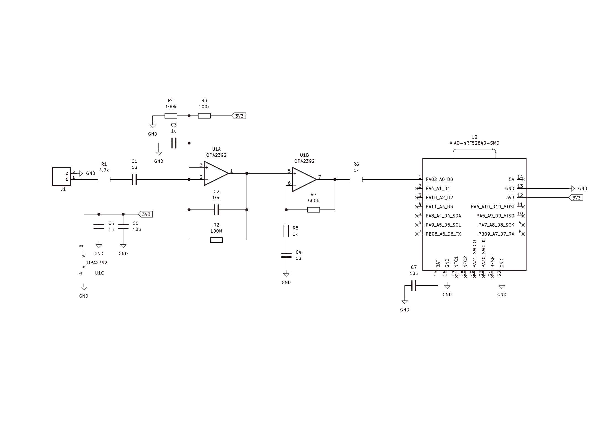
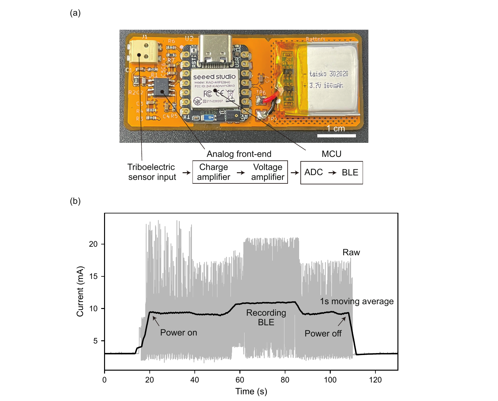

# All-PU Nanomesh Triboelectric Throat Sensor

This repository provides hardware, firmware, and software information for the
wireless acquisition system used with a triboelectric sensor. For the scientific
background, device concept, experimental results, and interpretation, please
refer to the associated paper.

If you use or refer to any part of this repository, please cite the paper listed
in the [Citation](#citation) section at the end of this README.

## Contents

```text
hardware/
  gerber/                       PCB fabrication outputs for the TENG module
firmware/
  xiao_nrf52840/
    xiao_nrf52840.ino           Arduino firmware for Seeed XIAO nRF52840
software/
  pyqt_gui/
    app.py                      PyQt GUI entry point
    data_source.py              Source interface used by the GUI
    data_source_ble.py          BLE acquisition backend
    ui_main.py                  GUI layout, plotting, filtering, CSV export
    requirements.txt            Python dependencies
docs/
  images/
    Analog_circuit.pdf          Analog front-end and MCU schematic
    FPCB.pdf                    Wireless module and FPCB design figure
    *.png                       README preview images generated from the PDFs
```

## Hardware

The hardware release provides the analog circuit figure, the wireless module
FPCB figure, and the PCB fabrication package for the TENG module. The Gerber job
file identifies the design as `TENG_module`, generated by KiCad 9.0.6.

### Circuit Configuration



Source figure: [`Analog_circuit.pdf`](docs/images/Analog_circuit.pdf)

The acquisition circuit receives the triboelectric sensor output through the
input connector and routes it to an OPA2392-based two-stage analog front end.
The first stage is configured as a charge-amplifier stage for the high-impedance
triboelectric signal. The second stage provides voltage amplification and
conditioning before the signal is connected to the `A0` analog input of the
Seeed Studio XIAO nRF52840.

The XIAO nRF52840 performs ADC sampling for the conditioned triboelectric sensor
signal and sends the acquired data to the PC over BLE. The XIAO on-board PDM
microphone is used as the second acquisition channel in the firmware and GUI.

### Bill of Materials

| No. | Qty. | Description | Designator | Footprint | Value | Manufacturer Part | Manufacturer | Supplier Part | Supplier |
| --- | --- | --- | --- | --- | --- | --- | --- | --- | --- |
| 1 | 2 | SMD thin-film resistor | R5, R6 | R_0603 | 1 kOhm | ERA3AEB102V | Panasonic | C190613 | LCSC |
| 2 | 1 | SMD thin-film resistor | R1 | R_0603 | 4.7 kOhm | ERA3AEB472V | Panasonic | C473239 | LCSC |
| 3 | 2 | SMD thin-film resistor | R3, R4 | R_0603 | 100 kOhm | ERA3AEB104V | Panasonic | C190609 | LCSC |
| 4 | 1 | SMD thick-film resistor | R7 | R_0603 | 499 kOhm | ERJ3EKF4993V | Panasonic | C278628 | LCSC |
| 5 | 1 | SMD thick-film resistor | R2 | R_0805 | 100 MOhm | 0805W8F1006T5E | UNI-ROYAL | C169373 | LCSC |
| 6 | 1 | SMD capacitor | C2 | C_0603 | 10 nF | GRM1885C1H103JA01D | Murata | C85973 | LCSC |
| 7 | 4 | SMD capacitor | C1, C3, C4, C5 | C_0603 | 1 uF | GCM188R71E105KA64D | Murata | C85862 | LCSC |
| 8 | 2 | SMD capacitor | C6, C7 | C_0603 | 10 uF | GRM188Z71A106KA73D | Murata | C2959727 | LCSC |
| 9 | 1 | Operational amplifier | U1 |  | OPA2392DR | OPA2392DR | Texas Instruments | C22428420 | LCSC |
| 10 | 1 | BLE microcontroller module | U2 |  | Seeed Studio XIAO nRF52840 Sense |  | Seeed Studio |  | JD.com |
| 11 | 1 | Spring terminal block | J1 |  |  | 2059-302/998-403 | WAGO | C2765060 | LCSC |
| 12 | 1 | Lithium polymer battery |  |  | 3.7 V, 100 mAh | 302020-100mah | Taisko | C19632322 | LCSC |

### FPCB Design



Source figure: [`FPCB.pdf`](docs/images/FPCB.pdf)

The FPCB integrates the triboelectric sensor input connector, the analog
front-end components, the XIAO nRF52840 module, and a small battery connection
on a compact wireless module. The signal flow is:

```text
Triboelectric sensor input -> charge amplifier -> voltage amplifier -> ADC -> BLE
```

The module is designed to acquire the throat-mounted triboelectric sensor signal
and transmit it wirelessly while remaining compact enough for on-body
measurements.

Board metadata from `hardware/gerber/TENG_module-job.gbrjob`:

- Board size: 63.05 mm x 26.05 mm
- Layer count: 2 copper layers
- Board thickness: 1.6 mm
- Fabrication files: top/bottom copper, solder mask, solder paste, silkscreen,
  edge cuts, plated drill, non-plated drill, and Gerber job metadata

### Circuit Role

The hardware files describe the sensor-module PCB used with the all-PU
nanomesh triboelectric throat sensor. In the acquisition workflow, the sensor
signal is conditioned by the analog front end and connected to the XIAO
nRF52840 analog input (`A0`) as channel 1. The XIAO on-board PDM microphone is
used as channel 2 for simultaneous reference audio acquisition.

For analog acquisition, the firmware expects the channel-1 signal to stay
within the XIAO nRF52840 ADC input range. If a mid-supply bias is used by the
analog front end, the GUI subtracts the mean of channel 1 after capture for
visualization.

## Firmware

Firmware path: `firmware/xiao_nrf52840/xiao_nrf52840.ino`

The firmware turns a Seeed Studio XIAO nRF52840 into a BLE peripheral named
`XIAO-AUDIO`. It records two channels and transfers the captured block to the PC
after recording.

### Firmware Design Policy

- Keep the microcontroller workflow deterministic: record first, then transfer.
- Use fixed-size buffers to avoid dynamic allocation during acquisition.
- Store both channels against a shared 8 kHz sample index.
- Discard the first 1 s of samples as warm-up to reduce startup transients.
- Use BLE indications for acknowledged transfer rather than unacknowledged
  notifications.
- Keep the BLE protocol small: one control byte starts capture or shutdown.

### Sampling

- Channel 1: SAADC on `A0`, sampled at 8 kHz
- Channel 2: on-board PDM microphone, captured at 16 kHz and decimated by 2
- Storage and transfer rate: 8 kHz per channel
- Maximum stored samples: 32,000 samples per channel
- Maximum capture duration: 4 s
- Warm-up discard: 1 s before storing the requested capture window

### BLE Protocol

Service UUID:

```text
19B20000-E8F2-537E-4F6C-D104768A1214
```

CTRL characteristic, PC to XIAO:

```text
19B20001-E8F2-537E-4F6C-D104768A1214
```

Payload:

- `0x01` to `0x04`: capture duration in seconds
- `0xFF`: enter low-power System OFF

AUDIO characteristic, XIAO to PC:

```text
19B20002-E8F2-537E-4F6C-D104768A1214
```

Each AUDIO packet contains:

1. `seq`: 2-byte little-endian sequence number
2. `payload`: stereo interleaved little-endian `int16` samples

The payload format is:

```text
[ch1_0, ch2_0, ch1_1, ch2_1, ...]
```

The current firmware sends 50 stereo frames per packet, corresponding to 200
payload bytes plus the 2-byte sequence number.

### LED States

- Disconnected idle: red blink
- Connected idle: blue blink
- Recording: solid blue
- Transferring: solid green
- Shutdown acknowledgement: brief purple indication

## Software

Software path: `software/pyqt_gui/`

The PC software is a PyQt6 GUI that connects to the XIAO nRF52840 over BLE,
requests a capture, receives the interleaved two-channel data, and displays the
waveforms.

### Software Design Policy

- Keep the UI independent from the acquisition backend through `BaseSource`.
- Use Bleak for BLE central-mode scanning, connection, control writes, and
  indication subscription.
- Convert received little-endian `int16` PCM data to normalized `float32` data
  for plotting.
- Display captured data only after the firmware completes record-then-transfer.
- Provide optional 50 Hz bandstop filtering for visual inspection.
- Preserve raw data and allow CSV export of the displayed two-channel buffer.

### Python Setup

The pinned requirements are macOS-oriented because BLE access through Bleak on
CoreBluetooth uses the `pyobjc` packages.

From the repository root:

```bash
python -m venv .venv
source .venv/bin/activate
python -m pip install -r software/pyqt_gui/requirements.txt
```

### Run

From the repository root:

```bash
python -m software.pyqt_gui.app
```

The GUI starts in BLE mode, attempts to connect to `XIAO-AUDIO`, and enables
capture controls after the BLE connection is ready. Select a duration from 1 to
4 s and press `Start`.

## Data Format

The received waveform data are two-channel, interleaved `int16` samples:

```text
seq_lsb seq_msb ch1_lsb ch1_msb ch2_lsb ch2_msb ...
```

The GUI converts this byte stream into a NumPy array with shape `(N, 2)`.
Channel 1 is the ADC input; channel 2 is the PDM microphone input.

## Data Availability

The flexible printed circuit board design files, including PCB Gerber files,
firmware for the BLE module, and source code for the PyQt-based graphical user
interface are publicly provided in this repository.

## Notes

- The firmware uses a record-then-transfer workflow, so transfer begins only
  after acquisition is complete.
- A requested 4 s capture includes an additional 1 s warm-up discard before the
  stored samples are collected.
- BLE indications improve transfer reliability but may be slower than
  notifications.
- The current release contains fabrication outputs for the PCB. If editable CAD
  source files are needed, add them separately from the Gerber package.

## Citation

If you use or refer to any part of this repository in a publication,
presentation, thesis, dataset, or derived research project, please cite the
following paper, which describes the sensor system associated with these files:

```text
Takuo Tachibana, Yusuke Ebihara, Yi Kao, Manabu Ezumi, Yan Li,
Kento Yamagishi, Tomoyuki Yokota, Tian-Ling Ren, and Takao Someya,
"An All-Polyurethane Nanomesh Triboelectric Sensor for Swallowing and Voice Detection."
```

The citation information will be updated with journal, year, volume, pages, and
DOI after publication.

## License

The software, firmware, and circuit design files in this repository may be used
for research purposes.

See `LICENSE` for the full license text.
